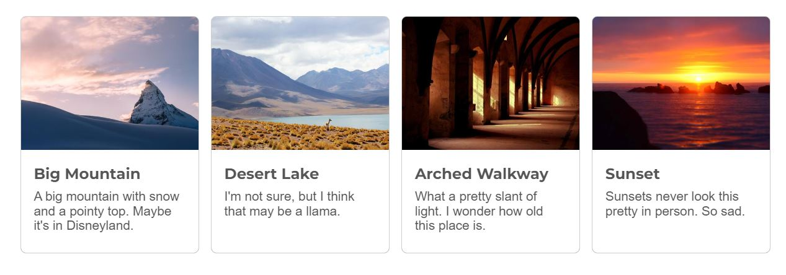
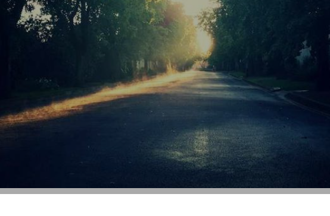

<!-- cSpell:enable  -->

# Overlays and cards

**Objectives**: Add a text overlay to your hero image. Use a dynamic font for the `<h1>` in the overlay. Add four cards to your site. Add a hover effect to your cards.

**Concepts covered**: The position property, text shadows, gradients, CSS filters, the `clamp()` function.

| :warning: This assignment builds on your _CSS fonts and a button_ assignment                                                                                                                                                                                                                                                                                                                                                                               |
| :--------------------------------------------------------------------------------------------------------------------------------------------------------------------------------------------------------------------------------------------------------------------------------------------------------------------------------------------------------------------------------------------------------------------------------------------------------- |
| After cloning this repo and opening it in VSCode, copy the following files and folders from your _CSS fonts and a button_ assignment into this repo.<br><br><ul><li>📄 index.html</li><li>📄 favicon.ico</li><li>📁styles</li><li>📁images</li><li>📁about</li><li>📁contact</li></ul><br>**Make sure that you don't copy any other folders or files, including the `test` folder, the hidden `.git` and `.github` folders, and the `package.json` files** |

## Hero overlay

| ⚠️ Centering vertically                                                                                                                                                                                                                                 |
| :---------------------------------------------------------------------------------------------------------------------------------------------------------------------------------------------------------------------------------------------------------------------------------------- |
| Don't worry about vertically centering items well right now. Flexbox makes centering so easy, it's better to wait until we learn flexbox to vertically center elements. Use margins or padding for now. You may see an old school centering using `position: absolute; top: 50%; transform: translate(0, -50%);` &ndash; you are welcome to try it, but...flexbox...so much easier... |

- Add a `<p>` with a subtitle below your `<h1>`.
- Wrap your `<picture>`, `<h1>` and subtitle in a `<div>` with class `.hero`.
- Use the CSS `position` property to overlay your `<h1>` text and subtitle on top of your hero image. You may want to group your heading and subtitle with a `<div>`
- Use either a semi-transparent `background-color`, with or without a gradient, or a `filter` to de-emphasize the hero image. Make sure that the overlay gradient or filter covers the entire image (no visible gaps). You can use a `::before` pseudo-element to add the gradient or filter.
- Adjust the color of the text to make it readable on top of the hero image.
- Adjust the font size, line-height, and margins or paddings so that `<h1>` and `<p>` "look good" on a full screen (remember what you learned in the Whitespace assignment). In the next section, you'll add dynamic font sizing to your `<h1>` for narrower (tablet and mobile) viewports. Don't worry about making it look good on tablet or mobile yet.
- The text should be positioned over the hero image – it does not have to be centered. Flexbox will simplify positioning text, so don't spend time trying to perfectly position the text. At a minimum, it should at least be offset from the edge of the image.
- Add a subtle text-shadow to your `<h1>` (and possibly your subtitle) to make it stand out.


| 💡 Helpful resources |
|:---|
| - [Learn more about CSS filters at CSS-Tricks](https://css-tricks.com/almanac/properties/f/filter/) |
| - [CSS Text Shadow Generator](https://www.cssportal.com/css3-text-shadow-generator/)
|

## Dynamic font size

Use the `clamp()` function to dynamically size your `<h1>` font on your hero image.

| 🎥 Watch my [Dynamic font sizing with CSS](https://youtu.be/0UZmXR3M82g) video [~ 8 minutes]                                                                                                                                                                                                                                                    |
| :------------------------------------------------------------------------------------------------------------------------------------------------------------------------------------------------------------------------------------------------------------------------------------------------------------------------ |
| This video shows how to use the `clamp()` function to set the font size of your `<h1>` so that it dynamically adjusts its font size so it readable on full screen, but not too big on tablet or mobile. I've included links to the websites referenced in the video below. |

Since you want only the `<h1>` on the hero image to dynamically resize, not the `<h1>` elements on other pages, using the hero class to target it specifically.

```css
.hero h1 {
  font-size: clamp(3.5rem, 10vw + 1rem, 10rem);
}
```

_Don't just copy and paste the CSS above, rather figure out the best font sizes for your site and generate a clamp() function unique to your website._

| 🔥 **Links to websites in the video**: Smoother font sizing with _linear interpolation_                                                                                                                                                                                                                                                                                                                                                                                                        |
| :---------------------------------------------------------------------------------------------------------------------------------------------------------------------------------------------------------------------------------------------------------------------------------------------------------------------------------------------------------------------------------------------------------------------------------------------------------------------------------- |
| For the math behind the linear interpolation, see CSS Trick's [Linearly Scale font-size with CSS clamp() Based on the Viewport](https://css-tricks.com/linearly-scale-font-size-with-css-clamp-based-on-the-viewport/). The article did contain a tool to build the `clamp()` statement for you but it's currently broken. <br><br>Another tool to generate a `clamp()` statement is [Adrian Bece's Modern fluid typography editor](https://modern-fluid-typography.vercel.app/). |

`clamp()` is not limited to fonts. You can use it to limit the maximum and minimum size on other elements as well. To learn more, read MDN's page on [clamp()](https://developer.mozilla.org/en-US/docs/Web/CSS/clamp). The page also compares `clamp()` to other useful functions such as `min()` and `max()`.

## Adding cards

Cards are ubiquitous on the internet. They are teasers, usually images and text, that are used to link to other pages or to provide additional information. They are often used to display a collection of items, such as a list of articles or blog posts or a list of products.

For this assignment, we will create four cards. Since we haven't learned layouts yet, don't worry so much if they don't look good on tablet or mobile. We will learn how to use a flexbox to make them responsive in a future assignment.

Below is a sample of some basic cards:



Before we start, we need to determine the maximum width needed for the images on our cards. For this assignment, we ignore [device pixel ratios](https://tomroth.com.au/dpr/) and will assume a maximum viewport width of 2000px. Therefore, the maximum width of our images is 500px or 2000px / 4.

**Find four images for your cards and resize and crop all of your images to a width of 500px.**

| ⚠️ Make sure your cards all have the same aspect ratio                                                                                                                                                                                                                                    |
| :---------------------------------------------------------------------------------------------------------------------------------------------------------------------------------------------------------------------------------------------------------------------------------------- |
| To make your life easier, **crop all your images so that they have the same width and height**. Square images (1:1) are easiest to work with when you make your site responsive, but rectangular images are doable. Save your original (full-size) image files for use in a later assignment. |


### :warning: Dealing with the validator warning "Section lacks heading."

The validator will issue a warning if your `<section>` does not have a heading. You have three options.

- 😬 [ok] Ignore the warning.
- 😐 [better] Change section to a div, but you lose the semantic meaning of a section.
- 😃 [best] Add a heading to your `<section>` for screen readers, but hide it from non-screen readers. To hide it, use the `.sr-only` class from the [WebAIM - Invisible Content Just for Screen Reader Users](https://webaim.org/techniques/css/invisiblecontent/).

```css
.sr-only {
  clip: rect(1px, 1px, 1px, 1px);
  clip-path: inset(50%);
  height: 1px;
  width: 1px;
  margin: -1px;
  overflow: hidden;
  padding: 0;
  position: absolute;
}
```

Requirements for this section:

- Add a `<section>` with class `.cards` that will contain four cards. The section can be inside or outside `<main>`. _If it is inside main, its width will be limited by the `max-width` of main. If the cards are outside main, add a "gutter" of at least 1rem on the left and right to offset the cards from the edge of the screen_
- Add four cards, each with a unique image and text (text can either be always visible or appear on hover or disappear on hover). You are welcome to model your cards after ones you've seen online or after some cards we reviewed in class.
- Card images are 500px wide. They can be any height, but should all be the same height. Make sure to add the `width` and `height` attributes to your `` elements with the images' intrinsic height and width so that the browser can reserve space for the images before it loads.
- Images are responsive, in other words, they resize if the card resizes. This means their CSS width is set to 100%, which will cause them to always fill the width of their container. This is already set in the `main.css` file I included in the earlier assignment. Below is the CSS snippet from the `main.css` file. Setting the `height` property to `auto` in your CSS will override the `height` attribute in the HTML and keep the image from being distorted when it resizes. `display: block` is also set to make sure the image is not inline which would make it have a line-height that would cause an overlay to have a gap below the image.

```css
img,
picture,
video,
canvas,
svg {
  display: block;
  max-width: 100%;
  height: auto;
}
```

   In the image below, notice the overlay "gap." The overlay is a semi-transparent grey and it shows as a thin line below an image with default inline display. It's caused by the line-height that all inline elements have. It's easily fixed by setting the display to block.

   

- Each card has its content wrapped in an `<a>`. The `<a>` element can be empty, meaning, you don't have to add an `href` or you can use `href="#"` which links to the top of the page - if you omit an `href`, set the cursor to pointer.

Below is an example of markup for your cards. You are welcome to adjust it to suit your design.

```html
<section class="cards">
  <a href="#" class="card">
    
    <p>card text</p>
  </a>

  ...

</section>
```

| 💡 Lazy loading images |
|:-----------------------|
| To improve performance, add the `loading="lazy"` attribute to your `` elements that are _below the fold_ or not immediately visible when the page is loaded. This will tell the browser to load the images only when they are visible in the viewport and save on page load time. |

Since, by default, `<a>` elements are inline elements, you will need to set the `display` property of any `<a>` elements inside the `.cards` class to `inline-block` to make them behave like block elements. However, if you use a flexbox layout, you won't need to do this. To simplify this assignment, I recommend adding this to your CSS and not worrying about changing the `<a>` display property. We will learn more about how to use flexboxes in a future assignment.

```css
.cards {
  display: flex;
  ...;
}

.card {
  flex: 1 1 0;
  ...;
}
```

If you want spacing between the cards you can add gap:

```css
.card {
  display: flex;
  gap: 1rem;
  ...;
}
```

Adjust the margins, padding, font-size, and other properties to suit your design.

### Card hover effect

Use the `:hover` pseudo-class to add a hover effect to your cards. Use one of the examples from class, or one you like. In the image below, the leftmost card has a box-shadow appear on hover.


Add a transition to smooth the hover. The transition property is added to the element in its un-hovered state. The basic format is

```css
transition: property duration timing-function;
```

To transition the `box-shadow` property over 300 milliseconds, you would use

```css
.card {
  ...
  transition: box-shadow 300ms ease;
```

View the [CodePen of these sample cards](https://codepen.io/lsburton/pen/MWwezZW?editors=1100).

## :arrow_up: Commit your changes and sync the changes to Github

### Check for errors or warnings

Use Live Server to check that your site displays correctly and make sure that the VS Code status bar doesn't show any errors or warnings. When you are ready, commit your changes and sync them to Github.

### 🚀 Publish your web page on Github Pages

Open your repo on Github. Publish your site on GitHub pages.

### ⚙️ Enter your repo about information

In your main repo page edit the About section. Enter a description of your repo and add your Pages URL in the **Website** text field.

## Validate your HTML with validator.nu

Once your page is live, use the [validator.nu](https://validator.nu/) service to validate the HTML on all three of your web pages (main, contact, about). Select Show "outline" and "image report" then paste your page URL into the validator and click Check.

**NOTE**: Make sure to check that your `contact` and `about` pages also validate, not just your main page.

Check that your heading outline is in order and that each image has a valid `alt` attribute.

If you have any errors, fix them in VSCode, commit and sync, and then re-validate your page. Make sure to wait a few minutes for Github to generate the updated page.

## Pass automated tests

After you've ensured that your page has validated, open your repo in Github and check that you've passed the automated tests. If you haven't passed all of the tests, fix any errors and commit and sync your changes.

### ⭐ Current automated tests

- HTML validation
- HTML proofer

*Three new tests were added. They are marked with a* ✨ *below*

Pretests (37):

- General HTML structure
  - REQUIRED `<head>` INFO
    - main index.html has `<title>`, `<meta>` description and favicon info
    - about index.html has `<title>`, `<meta>` description and favicon info
    - contact index.html has `<title>`, `<meta>` description and favicon info
  - STYLESHEETS LOADED
    - main index.html loads styles/main.css
    - about index.html loads styles/main.css
    - contact index.html loads styles/main.css
  - NO `<br>` TAGS
    - main index.html does not contain any `<br>` tags
    - about index.html does not contain any `<br>` tags
    - contact index.html does not contain any `<br>` tags
  - ONLY ONE `<h1>` IN AN HTML FILE
    - main index.html contains exactly one `<h1>`
    - about index.html contains exactly one `<h1>`
    - contact index.html contains exactly one `<h1>`
  - MAIN MENU
    - main index.html has a `<header>` containing a `<nav>` and a `<ul>`
    - about index.html has a `<header>` containing a `<nav>` and a `<ul>`
    - contact index.html has a `<header>` containing a `<nav>` and a `<ul>`
    - main index.html - relative paths used in main menu; paths do not end with 'index.html'
    - about index.html - relative paths used in main menu; paths do not end with 'index.html'
    - contact index.html - relative paths used in main menu; paths do not end with 'index.html'
- Image tests
  - image paths are all lowercase and contain no spaces
  - images must be 2000px wide or less
  - relative paths to images used, and images must be in the images directory
  - non-SVG and non-`<picture>` `` height and width attributes set to the image's intrinsic dimensions
  - `<picture>` element must contain three `<source>` elements with media and srcset attributes
  - about page includes an `` element that uses `srcset` and `sizes` to load three versions of the same image with different widths
  - contact page loads an SVG file with ``
- MAIN index.html ONLY
  - main index.html must contain a `<picture>`, one `<main>`, at least two `<article>`, an `<aside>`, and a `<footer>`
  - `<article>` must contain an `<h2>` and at least one `<p>`
  - ✨ `<div class="hero">` contains an `<h1>` and a `<p>`
  - ✨`<section class="cards">` contains four cards, each with class `card`
- CSS tests
  - `!important` never used
  - global `box-sizing` rule set to `border-box` and `:root` contains CSS variables
  - `font-family` and `color` set in `body`
  - remove underlines from `<a>` and add `:hover` class for all `<a>` that contain `href` attribute
  - CSS contains `.button` and `.button:hover` declarations
  - footer has styling including `background-color`
  - main has `max-width` set
  - ✨ hero `h1` font-size set using `clamp()`


| :heavy_check_mark: You will also be graded on the following items from the rubric:                                                                                                                                                                          |
| :---------------------------------------------------------------------------------------------------------------------------------------------------------------------------------------------------------------------------------------------------------- |
| <ul><li>Hero image is de-emphasized with a semi-transparent background, a gradient background, or a filter</li><li>Cards have a hover effect with a transition</li><li>The general appearance of your web page – proper spacing, font size, etc. </li></ul> |

## 📝 Submit link to repo on Slack

_When you are ready for you assignment to be graded, submit a link to your Github repo on Slack in the **Overlays and Cards** assignment channel._